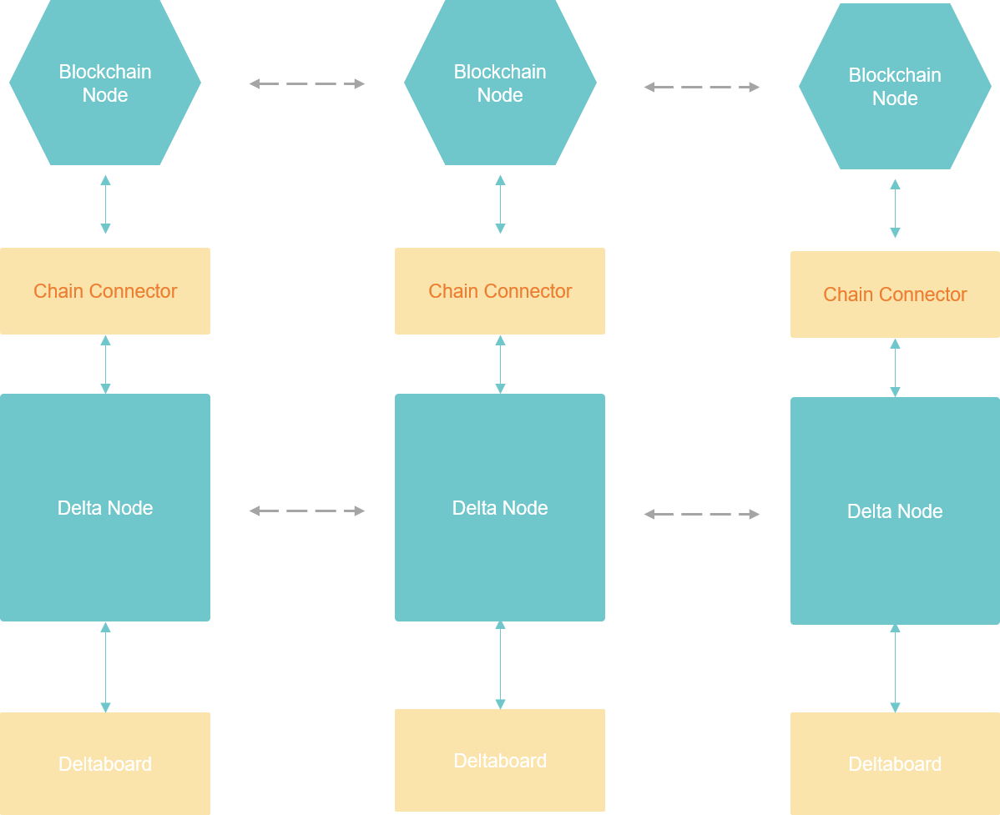
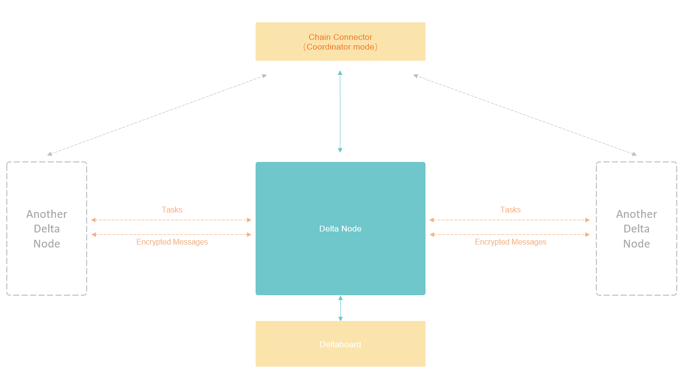

# delta-chain-connector

Chain Connector is an abstract layer connecting Delta Node and the Blockchain. Chain Connector provides a unique set of APIs to Delta Node regardless of the type of Blockchain system used. And Chain Connector handles the Blockchain transaction signing. In a strict security environment, Chain Connector supports using an isolated signer to keep the private key offline and submit the signature remotely, thus keeping the private key safe.




Chain Connector could be configured to run at "coordinator" mode. At coordinator mode, Blockchain is not required. Chain Connector itself behaves like a center node of the whole network. All the Delta Nodes in the network connect to the same Chain Connector to submit and receive Delta Tasks.




# run delta-chain-connector from source code

First git clone this repo.

Then install the package from source code.

```bash
cd delta-chain-connector
npm install
npm run build:ts
npm link
```

## configuration

We need to configure delta-chain-connector before start it. Run this command to initialize the config file:

```bash
delta-chain-connector init
```

Then we will see a directory called `config` is created, and in `config` directory, there is a config file called `config.json`.

The config file looks like: 

```json
{
  "log": {
    "level": "info"
  },
  "impl": "monkey",
  "monkey": {
    "db": {
      "type": "sqlite",
      "url": "db/chain.db"
    }
  },
  "chain": {
    "nodeAddress": "",
    "privateKey": "",
    "provider": "wss://apus.chain.deltampc.com",
    "gasPrice": 1,
    "gasLimit": 4294967294,
    "chainParam": {
      "chainId": 42,
      "name": "delta"
    },

    "identity": {
      "contractAddress": "0x43A6feb218F0a1Bc3Ad9d9045ee6528349572E42"
    },
    "hfl": {
      "contractAddress": "0x3830C82700B050dA87F1D1A60104Fb667227B686"
    }
  },
  "host": "0.0.0.0",
  "port": 4500
}
```

Delta chain connector will start a grpc server for delta node to connect. Item `host` and `port` means the host and port of the grpc server, respectively.

### coordinator mode configuration

To run delta-chain-connector in coordinator mode, we need to set `impl` to `monkey`.

```json
  "impl": "monkey",
```

Configurationa of coordinator mode are in the section `monkey` in config file.

```json
  "monkey": {
    "db": {
      "type": "sqlite",
      "url": "db/chain.db"
    }
  },

```

Coordinator mode need to use a database. The default configuration uses sqlite and store database file in `db/chain.db`.
You can change these configurations by yourself.

### chain mode configuration

To run delta-chain-connector in coordinator mode, we need to set `impl` to `chain`.

```json
  "impl": "chain",
```

Configurationa of coordinator mode are in the section `chain` in config file.

```json
  "chain": {
    "nodeAddress": "",
    "privateKey": "",
    "provider": "wss://apus.chain.deltampc.com",
    "gasPrice": 1,
    "gasLimit": 4294967294,
    "chainParam": {
      "chainId": 42,
      "name": "delta"
    },

    "identity": {
      "contractAddress": "0x43A6feb218F0a1Bc3Ad9d9045ee6528349572E42"
    },
    "hfl": {
      "contractAddress": "0x3830C82700B050dA87F1D1A60104Fb667227B686"
    }
  }
```

To use chain mode, you need to provide `nodeAddress` (refers to a wallet address compatible with Ethernet) and `privateKey` (refers to the wallet private key), 
because in chain mode, connector needs to sign and send transactions to the chain.
Delta chain connector will keep the private key secret.

Other configurations meanings:

| name | meaning |
| provider | blockchain node provider (should be a websocket) |
| gasPrice | gas price for each transaction |
| gasLimit | gas limit for each transaction |
| chainParam.chainId | chain id |
| chainParam.name | chain name |
| identity.contractAddress | identity contract address |
| hfl.contractAddress | hfl contract address |

If you don't want to deploy the contracts in your own chain by yourselef, you don't need to change these configurations.
The default configurations will connect to the contracts deployed in the delta test chain.

If you use the default configurations, you need to query for delta test chain tokens for sending transcations.
You can do this join in the [slack](https://join.slack.com/t/delta-mpc/shared\_invite/zt-uaqm185x-52oCXcxoYvRlFwEoMUC8Tw), and query for tokens in the `delta-chain-faucet` channel.

## start delta chain connector

Enter the following command

```bash
delta-chain-connector run
```

The connector will be started.


# run delta-chain-connector from docker

We have built the docker image of delta-chain-connector and you can run it from docker for convenience.

First, pull the docker image:

```bash
docker pull deltampc/delta_chain_connector:0.3.0
```

and then make a directory as the root dir of the connector.

```bash
mkdir delta-chain-connector
cd delta-chain-connector
```

## configuration

Run this command to generate the default configuration file.

```bash
docker run -it --rm -v ${PWD}:/app deltampc/delta_chain_connector:0.3.0 init
```

You will see the configuration file in `config/config.json`. You can edit the configuration file as described above.

## start delta chain connector

Enter the following command

```bash
docker run -d --name=chain_connector -v ${PWD}:/app -p 4500:4500 deltampc/delta-chain-connector:0.3.0 run
```

The connector will be started.

You can enter this command to see the logs of connector

```bash
docker logs -f chain_connector
```